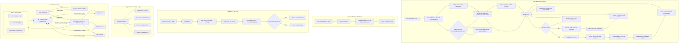

# SPA (& SSR) Architecture

```mermaid
flowchart TD
    %% ================= SPA Flow =================
    subgraph SPA["SPA (& SSR) Architecture"]
        SPA1[User opens SPA page] --> SPA2[Check URL: / or /#/vocab or /#/sentences]
        SPA2 --> SPA3{Load Data from localStorage or fetch JSON}
        SPA3 --> SPA4[Set current index from localStorage or default 0]
        SPA4 --> SPA5[Render card]

        SPA5 --> SPA6{Practice mode?}
        SPA6 -- Yes --> SPA7[Render quiz buttons]
        SPA6 -- No --> SPA8[Render word, phonetic, meaning]

        SPA7 --> SPA9[Attach quiz button click handlers]
        SPA9 --> SPA10[Check answer correct or incorrect]
        SPA10 --> SPA11[Update learned metadata and XP]
        SPA11 --> SPA12[Save learned words to localStorage]
        SPA12 --> SPA5

        SPA8 --> SPA13[Check audio file availability]
        SPA13 --> SPA14[Enable or disable speak button]
        SPA14 --> SPA5

        SPA5 --> SPA15[Update stats badges and progress bar]
        SPA4 --> SPA16[Attach prev/next button handlers]
        SPA16 --> SPA5
        SPA6 --> SPA17[Practice mode toggle handler]
        SPA17 --> SPA5

        %% Data
        SPA3 --> SPA18[Data source: vocab.json or sentences.json]
        SPA18 --> SPA3

        %% Navigation inside SPA
        SPA2 --> SPA19[URL params change pushState]
        SPA19 --> SPA4
    end

    %% ================= Hangul Markdown =================
    subgraph HangulMarkdown["Hangul Markdown Rendering"]
        H1[User opens 'Bài học' page] --> H2[Fetch hangul.md]
        H2 --> H3[Parse Markdown to HTML with marked.parse]
        H3 --> H4[Insert HTML into #card]
    end

    %% ================= Feedback Page =================
    subgraph Feedback["Feedback Page Flow"]
        F1[User opens 'Góp ý' page] --> F2[Display form]
        F2 --> F3[User fills name, email, message]
        F3 --> F4[User clicks 'Gửi' button]
        F4 --> F5[Form submitted to Formspree endpoint]
        F5 --> F6{Submission successful?}
        F6 -- Yes --> F7[Show success message]
        F6 -- No --> F8[Show error message]
    end

    %% ================= Navigation =================
    subgraph NAV["Navigation between SSR pages"]
        NAV1[Navigation bar links] --> NAV2[Từ vựng -> /#/vocab]
        NAV1 --> NAV3[Câu mẫu -> /#/sentences]
        NAV1 --> NAV4[Bài học -> lessons.html]
        NAV1 --> NAV5[Góp ý -> feedback.html]
    end

    %% ================= Firebase / Local DB =================
    subgraph Sync["Data Sync & Merge"]
        User["User (Frontend)"] -->|Login| FB_AUTH["FB_Auth (Firebase Auth)"]
        FB_AUTH -->|Auth token| User

        User -->|Read/Write| DB_CACHE["DB_Local (IndexedDB / PWA Cache)"]
        DB_CACHE --> DB_VOCAB["DB_Vocab"]
        DB_CACHE --> DB_SENT["DB_Sentences"]
        DB_CACHE --> DB_PROGRESS["DB_Progress"]

        DB_VOCAB <-->|mergeAndSync by key| FB_DB["FB_DB (Firestore / Realtime DB)"]
        DB_SENT <-->|mergeAndSync by key| FB_DB
        DB_PROGRESS <-->|mergeAndSync by key| FB_DB

        subgraph MergeLogic["Merge Logic per key"]
            direction LR
            level["level = max(local, fb)"]
            xp["xp = max(local, fb)"]
            nextReview["nextReview = min(local, fb)"]
        end

        DB_CACHE --> MergeLogic
        MergeLogic --> FB_DB

        FB_DB -->|Realtime update + merge| DB_CACHE
    end

```
